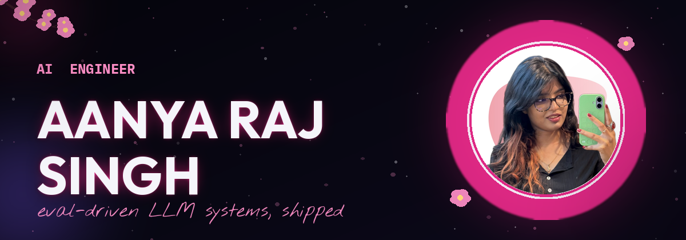

AI Engineer building production LLM systems — RAG pipelines, agentic workflows, and evals that ship.
📍 Noida, IN · Open to Remote/Hybrid

 

 

## 🌸 About Me 🌸

Hi, I'm Aanya — an AI Engineer specializing in LLM systems, RAG pipelines, and production-grade agentic AI.

I'm currently a Machine Learning / AI Engineer at **Dürr Group**, where I co-architected a multi-model AI chat platform serving **70K requests/month** and **20M tokens/day** across 5 models — with streaming, RAG, document intelligence, and agentic search for a German-HQ industrial group. Four years in, I've learned that getting AI to production is 20% modeling and 80% caring about the unglamorous things: evals, latency, failover, and whether the person using it can actually tell what's happening. I care a lot. It shows.

Before that, I spent 2.5+ years as a freelance Data Scientist, delivering 20+ end-to-end AI/ML projects across healthcare, finance, and e-commerce for clients around the world.

**What I care about:** eval-driven iteration over hype, clean metrics, and shipping systems that don't fall over at 2am.

 

## 🌸 Tech Stack 🌸

**🧠 AI &amp; LLMs**

**⚡ Backend**

**☁️ Cloud &amp; MLOps**

**🔬 ML &amp; NLP**

**📊 Data**

 

## 🌸 Selected Projects 🌸

| Project | What it does | Stack |
|---|---|---|
| 🌐 **[Enterprise GenAI Chat Platform](https://aanya-raj.github.io/aanya-portfolio/projects/genai-chat-platform)** | 70K requests/month across 5 LLMs, with streaming, RAG, and zero patience for downtime. | FastAPI · WebSocket · Celery/Redis · Azure OpenAI · Azure AD · OpenTelemetry |
| 🔍 **[RAG + Document Intelligence Pipeline](https://aanya-raj.github.io/aanya-portfolio/projects/rag-document-intelligence)** | Eval-driven retrieval pipeline — accuracy up 60%, latency cut in half. | Azure Document Intelligence · HNSW · Hybrid Search · Metadata Filtering · Python |
| 🎯 **[ML-Based Ticket Routing](https://aanya-raj.github.io/aanya-portfolio/projects/salesforce-ticket-routing)** | 95K+ tickets, a 73-queue taxonomy, and a routing model agents actually trust. | TF-IDF · LLM Features · scikit-learn · Salesforce |
| 🌍 **[AI Translation Workflow Tool](https://aanya-raj.github.io/aanya-portfolio/projects/ai-translation-tool)** | Replaced DeepL enterprise-wide — 850K+ events processed, licensing cost cut. | FastAPI · PyQt · Azure Cognitive Services |
| 📄 **[Automated Code Documentation](https://aanya-raj.github.io/aanya-portfolio/projects/code-documentation-generator)** | Point it at a repository, get real Markdown/DOCX documentation back. | Async Python · LLM APIs · Prompt Templates · Token Chunking |
| 🏥 **[Healthcare Chatbot for Diabetic Patients](https://aanya-raj.github.io/aanya-portfolio/projects/healthcare-chatbot)** | My first published work — classification-based chatbot for diabetic care. | NLP · Classification Models · Python |

More case studies → [aanya-raj.github.io/aanya-portfolio](https://aanya-raj.github.io/aanya-portfolio/) · Open-source work → [`eda-agent`](https://github.com/aanya-raj/eda-agent), a LangChain-based agent for automated exploratory data analysis.

 

## 🌸 Awards & Publication 🌸

🏆 **Super Squad Award** — Dürr Group (Q1 2026) — team award for technical leadership on Salesforce service-routing and lead-time prediction systems.

🏆 **Employee Spotlight Award** — Dürr Group (Apr 2025) — recognized by Global IT for delivery reliability and rapid MVP execution on a legal-AI document workflow.

📖 **Healthcare Chatbot for Diabetic Patients Using Classification** — Springer, *Lecture Notes in Networks and Systems*, Vol. 425.

 

## 🌸 Education 🌸

**B.Tech in Computer Science and Information Technology**
Mahatma Jyotiba Phule Rohilkhand University (MJPRU) · 2018 – 2022 · Bareilly, IN

 

## 🌸 GitHub Stats 🌸

🐍 **Contribution snake**

 

## 🌸 Say Hi 🌸

*eval-driven iteration, not hype ✦*

